

## Отчет

## Практическая работа 12

## Типы активностей. Шаблоны Android Studio. Сохранение настроек с SharedPreferences.

---

**ФИО:** Лапшин Никита Евгеньевич  
**Курс:** 2
**Группа:** ИНС-б-о-24-1  
**Направление:** 09.03.02 «Информационные системы и технологии»  

---
### Вариант 9
### Цель работы

Изучить различные типы шаблонов активностей, предоставляемых Android Studio. Научиться создавать многоэкранные приложения с использованием разных видов окон. Освоить механизм сохранения простых пользовательских настроек с помощью SharedPreferences.

### Ход работы

  
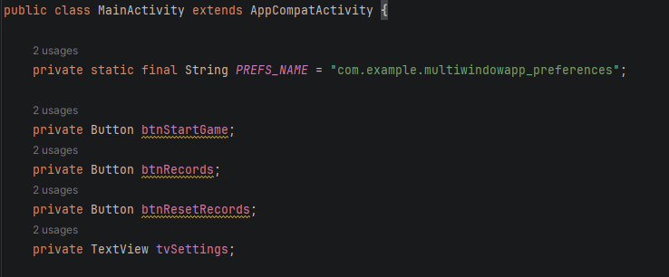

Рисунок 1 - Инициализация 

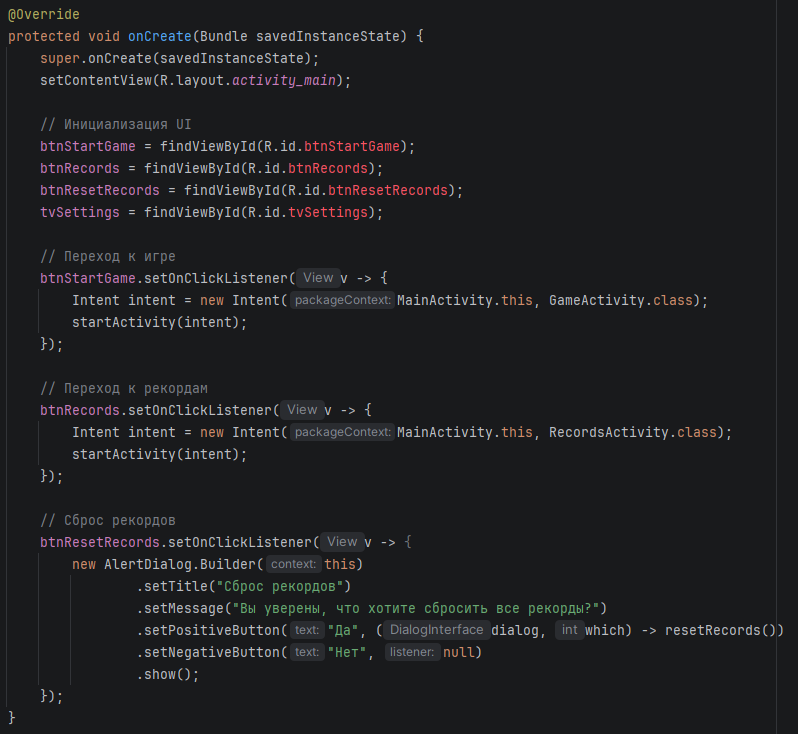

Рисунок 2 - Инициализация UI

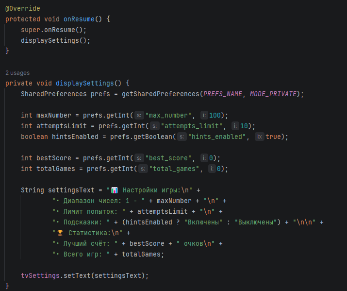

Рисунок 3 – Окно настроек

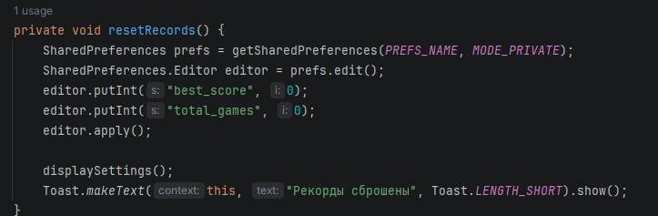

Рисунок 4 – Сброс рекорда

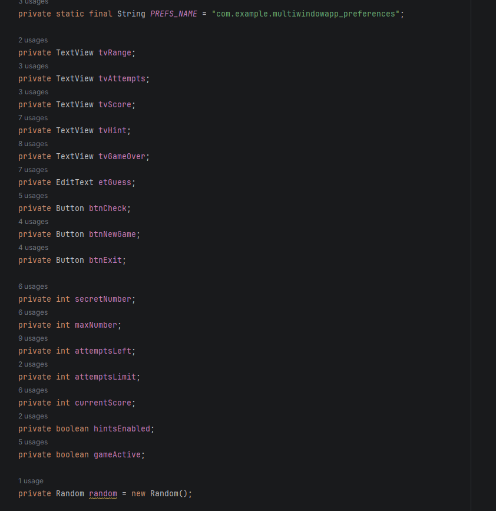

Рисунок 5 – Инициализация в GameActivity

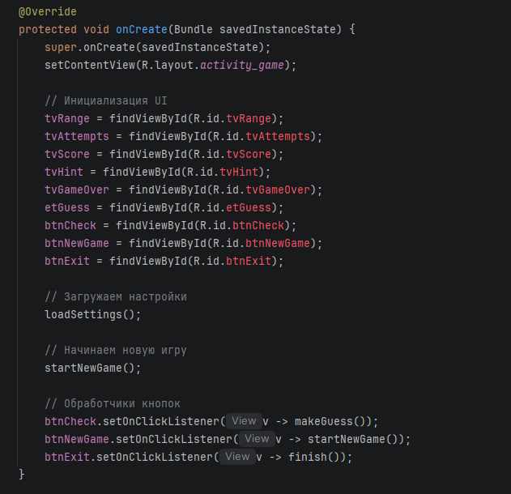

Рисунок 6 – Инициализация UI

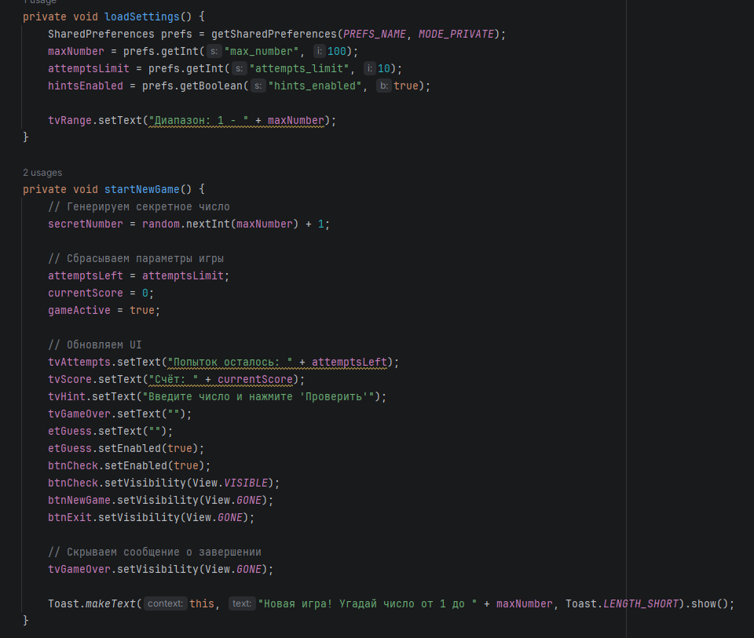

Рисунок 7 – Настройки, старт игры и обновление UI

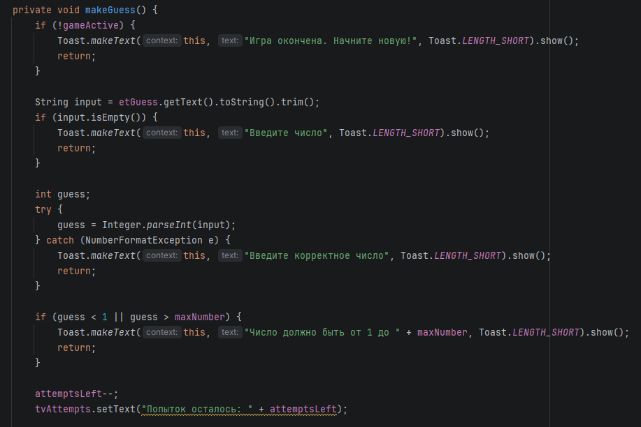

Рисунок 8 – Обработка логики игры

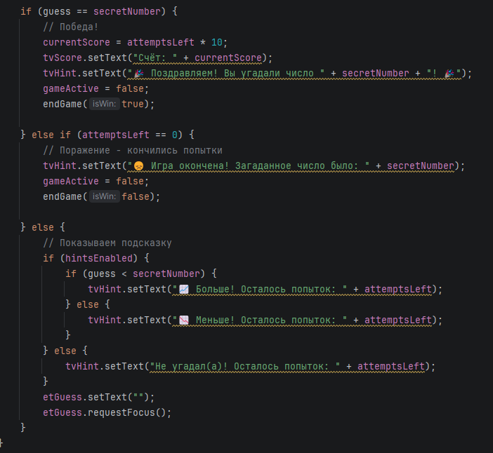

Рисунок 9 – Обработка победы, поражения и вывод подсказки

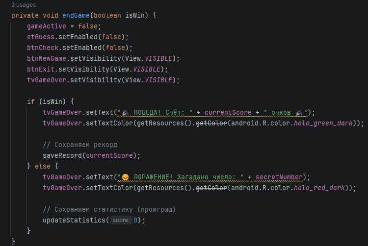

Рисунок 10 – Окончание игры

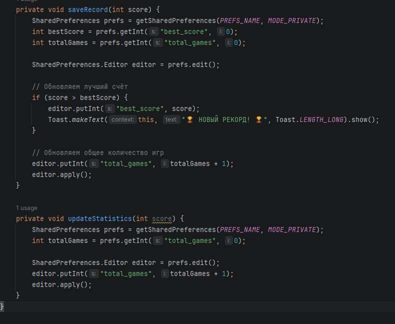

Рисунок 11 - Обновление рекорда

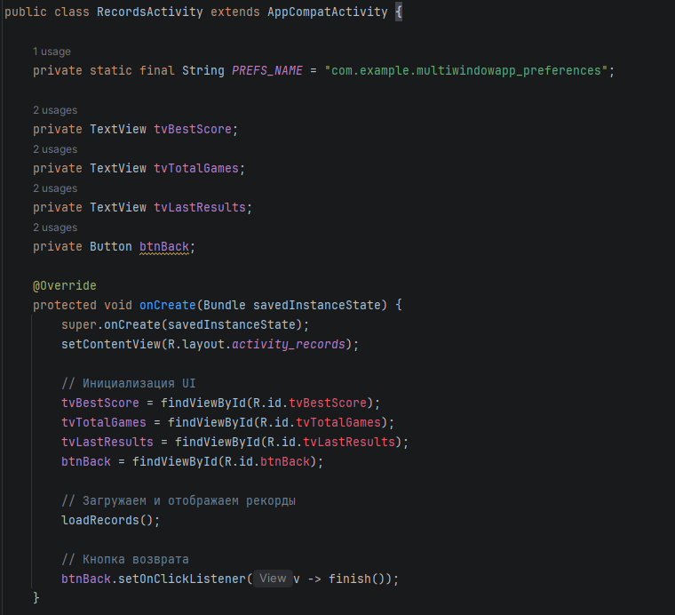

Рисунок 12 - Окно рекордов

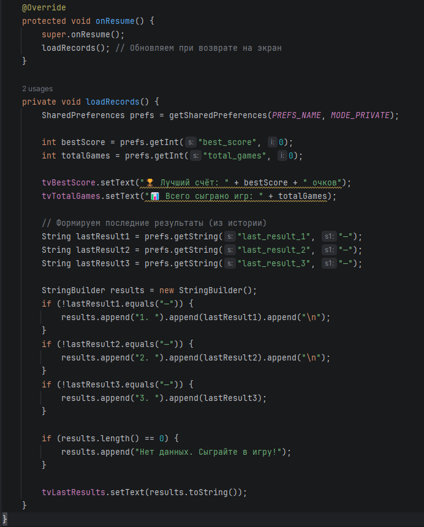

Рисунок 13 - Формирование наилучших результатов

Рисунок 14 - Главное меню

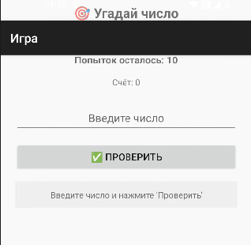

Рисунок 15 - Окно игры

Рисунок 16 - Окно рекордов

## Контрольные вопросы
1. Empty Views Activity (пустая основа), Settings Activity (готовый экран настроек с PreferenceFragment), Fullscreen Activity (полноэкранный режим, скрывает панели), Login Activity (форма входа/регистрации)
2. SharedPreferences — хранилище простых данных в виде пар "ключ-значение", можно хранить int, long, float, boolean, String, Set<String>.
3. getPreferences() создаёт файл для конкретной Activity, getSharedPreferences(name) — для указанного файла, PreferenceManager.getDefaultSharedPreferences() — единый файл по умолчанию.
4. Запись через editor.put...() и apply() (асинхронно) или commit() (синхронно, возвращает boolean) — apply() быстрее и не блокирует поток.
5. Чтение через prefs.getТип("key", defaultValue); значение по умолчанию нужно чтобы избежать NullPointerException, если ключ отсутствует.
6. New → Activity → Settings Activity, элементы настройки описываются в res/xml/preferences.xml (EditTextPreference, SwitchPreference и др.).
7. Intent intent = new Intent(CurrentActivity.this, TargetActivity.class); startActivity(intent);
8. FloatingActionButton — круглая плавающая кнопка действия, присутствует в шаблонах Scrolling Activity и Navigation Drawer Activity.
